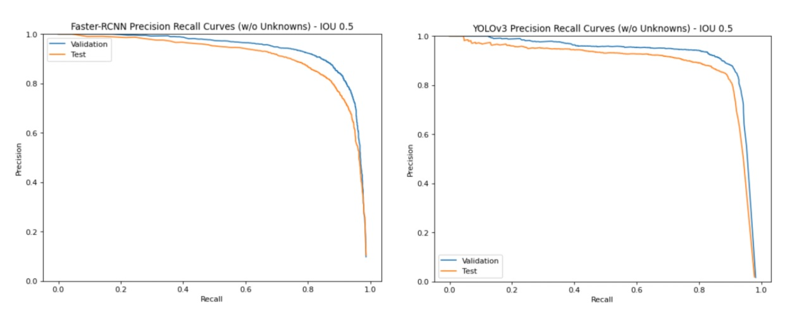

# Project Overview
Phishing is a widespread and dangerous method of social engineering designed to manipulate users into providing personal or confidential information through a malicious web page or email. Many phishing emails and web pages utilize brand logos in order to appear more legitimate. Therefore, accurately detecting logos on these sites and identifying the impersonated brand is significant for additional threat protection.

In this project, we built a logo detection and classification tool that will better aid our client, Proofpoint Inc, in combating brand impersonation in phishing attacks. We implemented state-of-the-art deep learning models to both detect logos on webpages and classify the brand to which they belong. We used Faster R-CNN, YOLO v3, and an ensemble of these models for logo detection and an EfficientNetB3 for logo classification. In addition, we set up a K-Nearest Neighbors based open set learning system on top of our classifier that distinguishes observed and unobserved logo classes, thus making our full pipeline deployable in an open set setting.

To quantify detection performance given our open set learning system, we also developed an adjusted precision metric. At an IoU of 0.5, our best ensemble detector achieved an open-set adjusted validation set precision of 0.93 and test set precision of 0.87 at a fixed recall of 0.87, while our best classifier achieved a test set precision of 0.98 and a recall of 0.94.

## Pipeline
The image below shows the overall pipeline of our project. First, we scraped and annotated images of web pages and documents. Next we trained Faster R-CNN and YOLO object detection models as well as an EfficientNetB3 classifier overlayed with a KNN method for open-set learning. Last, we evaluated our models and presented our results.

# Repository Guide
## Data
We have included sample images used in the train, validation, and test sets for our detectors and classifiers.

Following are the links to our google drive folders where all our data is stored.

**Classifier**

- [Train](https://drive.google.com/drive/folders/1StzIfIup9ikcyvm-FcNwb6QAuOBmw1dq?usp=sharing)
- [Validation](https://drive.google.com/drive/folders/1ceMyvxJG6LsLzkuojGthnJk-W8bU5tQD?usp=sharing)
- [Test](https://drive.google.com/drive/folders/14s9Yq7oIJYYb7iXIunLtK2KezZFCMitl?usp=sharing)

**Detector**

__All Images and Annotations__: __[HERE](https://drive.google.com/drive/folders/1yQ87y4ZyC_JLAuV_lH4uxp7fmWCbrRpJ?usp=sharing)__

## Models
### Classifiers
- [EfficientNetB3](/Models/Classifier/EfficientNetB3)

### Detectors
- [Faster R-CNN](/Models/Detectors/Faster_RCNN/training_a_faster_rcnn.ipynb)
- [YOLO](/LogoDetector/train.py)

__All Trained Weights__: __[HERE](https://drive.google.com/drive/folders/1wc6Dau6qJmxRKDt4LcSJ3FiTLSWFE2nP?usp=sharing)__

__All Open Set Learning Files__: __[HERE](https://drive.google.com/drive/folders/1tzL6nVip9L5sT7hCdc7YFWLaTvX0_WDA?usp=sharing)__

## Results
Final PR curves for our detectors on the validation and test set are shown below. For more detailed results, please refer to our paper.

## Docs
This section contains key documents written during this project. Please see the links below.

- [Final Paper](/Docs/Final_Paper.pdf)

## Literature_Review

- [Object Detection](Docs/Literature_Review/Object_Detection)
- [Open Set Learning](Docs/Literature_Review/Open_Set_Learning)
- [Small Object Detection](Docs/Literature_Review/Small_Object_Detection)

## Slides
Please see the links below for some of our key presentations during this project. Other presentations can be viewed by accessing the main folder.

- [April 9: MIDS Capstone Symposium](April_09_MIDS_Symposium.pdf)
- [April 22: Final Proofpoint Presentation](/Slides/Final_Client_Presentation.pdf)
